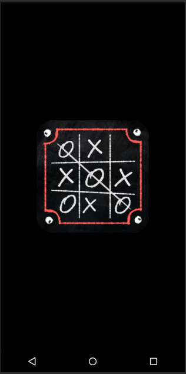
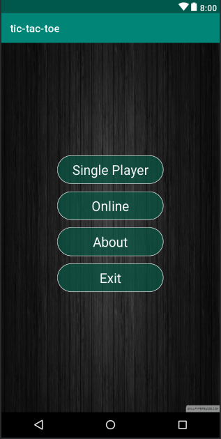
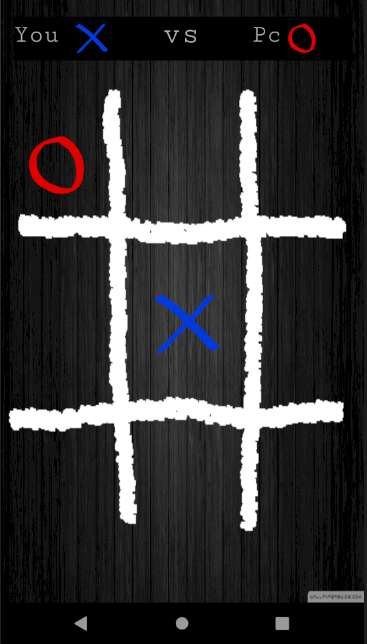
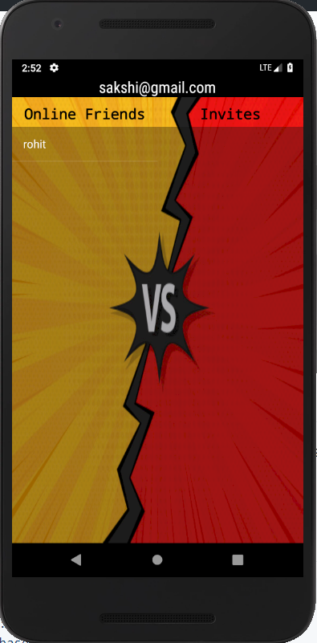

# Tic-Tac-Toe
Online multiplayer Tic-Tac-Toe using Google Firebase that allows you to connect and play online and also has a single player mode.

# Dependencies
```bash
    implementation 'com.google.firebase:firebase-core:16.0.4'
    implementation 'com.google.firebase:firebase-auth:16.0.5'
    implementation 'com.google.firebase:firebase-database:16.0.4'
    implementation 'com.android.support:appcompat-v7:28.0.0'
```
# Screenshots





